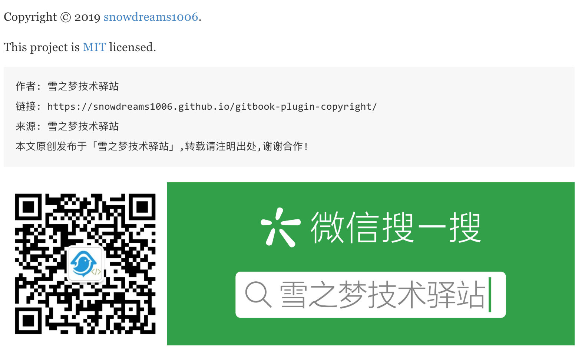

# gitbook-plugin-copyright 👋

[](https://www.npmjs.com/package/gitbook-plugin-copyright)
[](https://www.npmjs.com/package/gitbook-plugin-copyright)
[](https://github.com/snowdreams1006/gitbook-plugin-copyright#readme)
[](https://github.com/snowdreams1006/gitbook-plugin-copyright/graphs/commit-activity)
[](https://github.com/snowdreams1006/gitbook-plugin-copyright/blob/master/LICENSE)
[](https://github.com/snowdreams1006)
[](https://snowdreams1006.github.io/snowdreams1006-wechat-public.jpeg)

> `gitbook-plugin-copyright` 插件是基于 `Gitbook` 实现的版权保护插件,复制内容追加版本信息以及末尾添加小尾巴.

### 🏠 [主页](https://github.com/snowdreams1006/gitbook-plugin-copyright#readme)

## 特色

- 支持复制内容**自动追加**版本保护信息
- 支持文章末尾**自动生成**版本保护尾巴
- 支持自定义小尾巴**版权保护图片**
- 支持 `Gitbook` **多语言环境**



## 安装

首先,在 `book.json` 配置文件中**声明** `copyright` 插件,示例代码如下:

```json
{
    "plugins" : ["copyright"]
}
```

然后,在 `book.json` 配置文件中**配置** `copyright` 插件,示例代码如下:

```json
{
  "pluginsConfig": {
    "copyright": {
        "site": "https://snowdreams1006.github.io/gitbook-plugin-copyright",
        "author": "雪之梦技术驿站",
        "website": "雪之梦技术驿站",
        "image": "https://snowdreams1006.github.io/snowdreams1006-wechat-open.png"
    }
  }
}
```

其中,配置参数含义如下: 

- `site` : [必选]部署网站基本路径
- `author` : [必选]作者信息
- `website` : [必选]网站名称
- `image` : [可选]版权保护图片

最后,命令行内运行 `gitbook install` **安装插件**到本地,示例代码如下:

```bash
$ gitbook install
```

## 示例

不仅 [gitbook-plugin-copyright](https://github.com/snowdreams1006/gitbook-plugin-copyright) **官方文档**已整合 `copyright` 版权保护插件,此外还提供了示例项目,详情参考 `example` 目录.

无论是 `docs` **官方文档**还是 `example` **示例文档**,整合 `copyright` 版权保护插件真的很容易!

## 作者

👤 **snowdreams1006**

- Github: [@snowdreams1006](https://github.com/snowdreams1006)
- Email: [snowdreams1006@163.com](mailto:snowdreams1006@163.com)

## 🤝 贡献

如果你想贡献自己的一份力量,欢迎提交 [`Issues`](https://github.com/snowdreams1006/gitbook-plugin-copyright/issues) 或者 `Pull Request` 请求!

## 支持

如果本项目对你有所帮助,欢迎 ⭐️ [gitbook-plugin-copyright](https://github.com/snowdreams1006/gitbook-plugin-copyright) 项目,感谢你的支持与认可!

## 📝 版权

Copyright © 2019 [snowdreams1006](https://github.com/snowdreams1006).

This project is [MIT](https://github.com/snowdreams1006/gitbook-plugin-copyright/blob/master/LICENSE) licensed.
